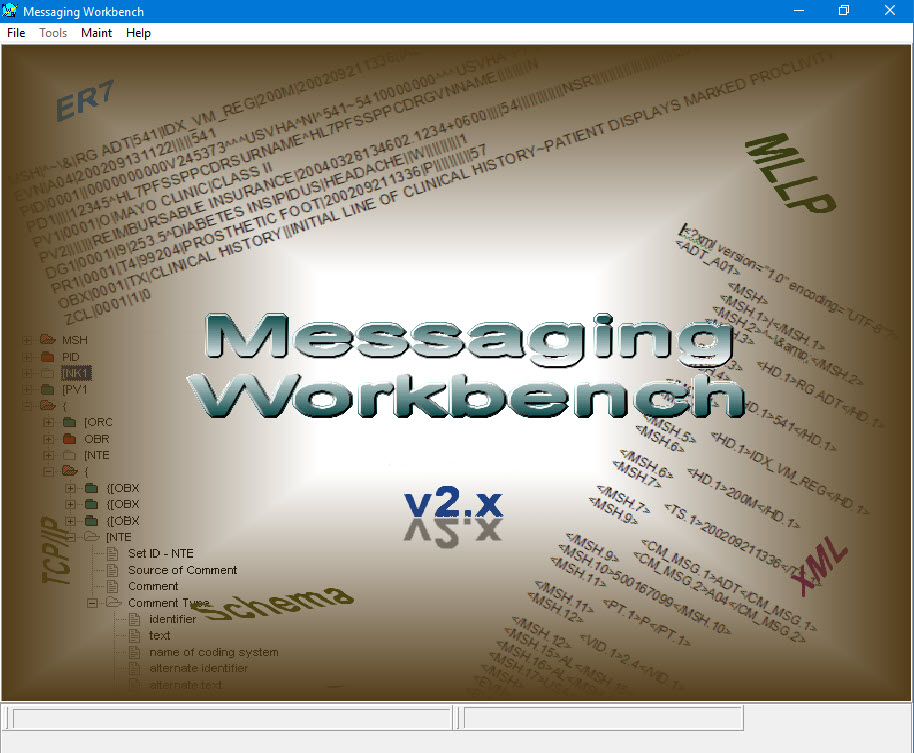
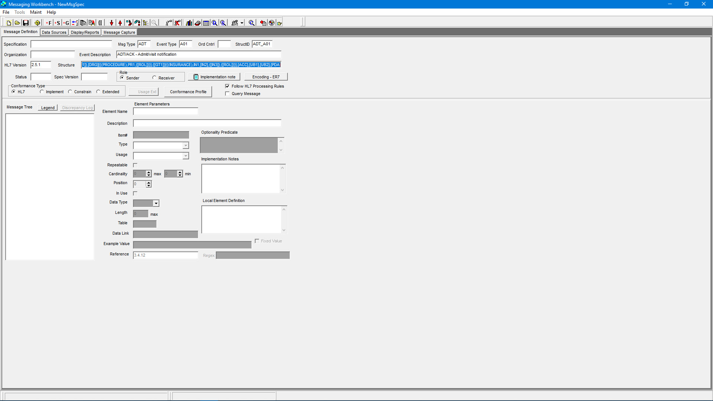
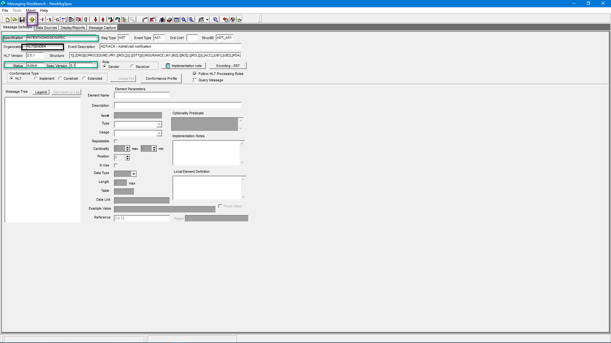
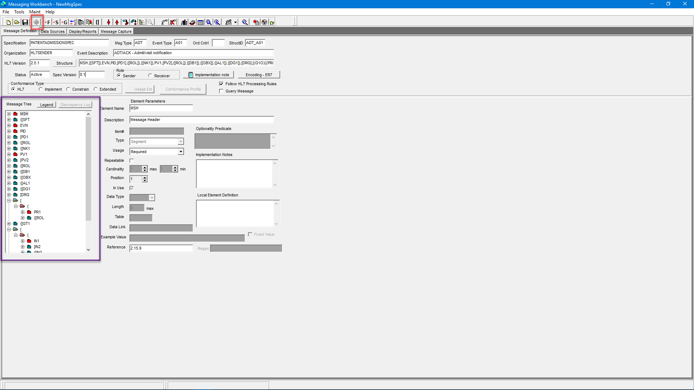
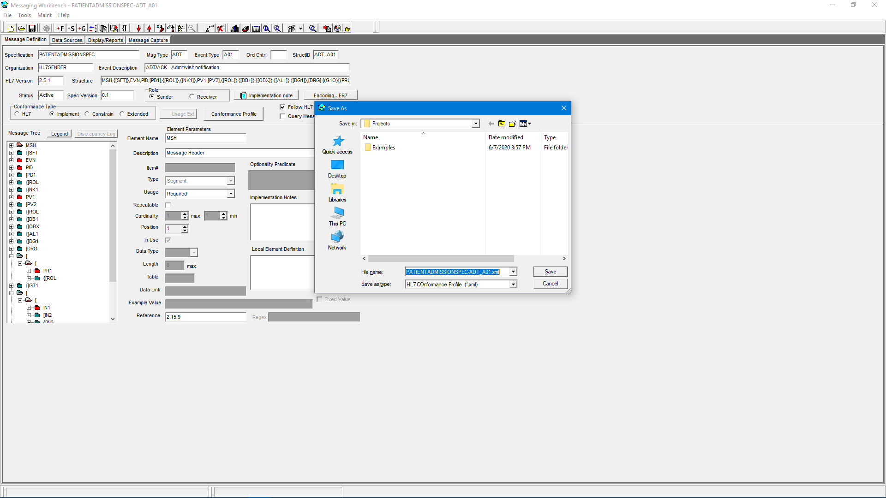
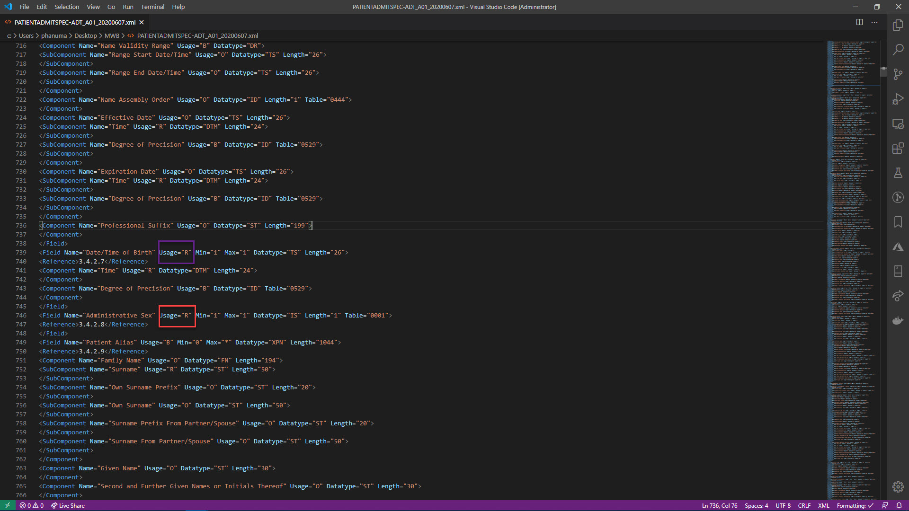

# HL7 Conformance Profile Generation

The goal of this repo is to document the way in which a HL7 conformance profile can be generated using the Message Work Bench tool.

## Motivation

I am working on a side-project that would validate a HL7 message, and present the errors in it to the user. The tool aims to ensure the message is structured properly in order to be able to process it. As expected, I'd done an extensive research to find if there is any blog that helps one to generate a HL7 Conformance Profile. Below are couple of important resources for starters -

References:

- [HAPI Portal](https://hapifhir.github.io/hapi-hl7v2/conformance.html)
- [Github - Saravanan Subramanian](https://github.com/SaravananSubramanian)

## Message Work Bench Tool

[Message Work Bench](http://www.hl7.org/documentcenter/public/wg/ictc/MWB%20Release%206.8.zip) is a tool that can be used to generate an conformance profile. It has offers several features like validating a HL7 message on the fly. The focus of this repo is to explain how the **Export HL7 Conformance Profile** can be used to generate an XML file, that can be used to validate a given message.

## Process

1. Download the tool by clicking [Message Work Bench](http://www.hl7.org/documentcenter/public/wg/ictc/MWB%20Release%206.8.zip)
2. Unzip the files into a folder
3. Navigate to the folder where you'd extracted the files
4. Open the **setup.exe** file to install the tool. You may want to go with the typical install when prompted.
5. Once the installation is complete, launch the software 
6. In the menu, select File -> Load Msg Structure and pick the message type to profile(Example - ADT_A03) 
7. Give a name to the profile. Also, add the organization name and the profile status as shown 
8. Click on the Compile icon to Compile the message. This will generate all the segments, fields according to the specification. 

9. Edit the default validations present in the Message Tree Option.

10. Using the File menu, Save the profile with an easy to remember and meaningful name in a folder.

11. Now, using the File menu again, open the Message Work Bench file that you've saved in the previous step.

12. Once it is open, using the File menu again, select the **Export HL7 Conformance Profile** option. This will prompt you to identify a folder to save the generated XML Conformance Profile. 

13. Open the XML file and verify for the changes you'd done. In this example, Patient Gender and Date of Birth were made "Required" fields, and the XML reflects the same. 

14. The saved XML profile is now ready to use in a Java program.

## Using the Conformance Profile

- See the repo [HL7 Conformance](https://github.com/castasint/HL7Conformance) on how to use the generated Conformance Profile in a Java program.

## Disclaimer

I'm not an expert in the HL7 domain. I'm just getting started. There may be various other tools using which one can generate the Conformance Profiles. I'm not vouching for the accuracy and the correctness Message Work Bench tool either. It is just that I happen to run into it, and it is also available for free. It can act as a starting point for the wonderful tool you're going to build.
